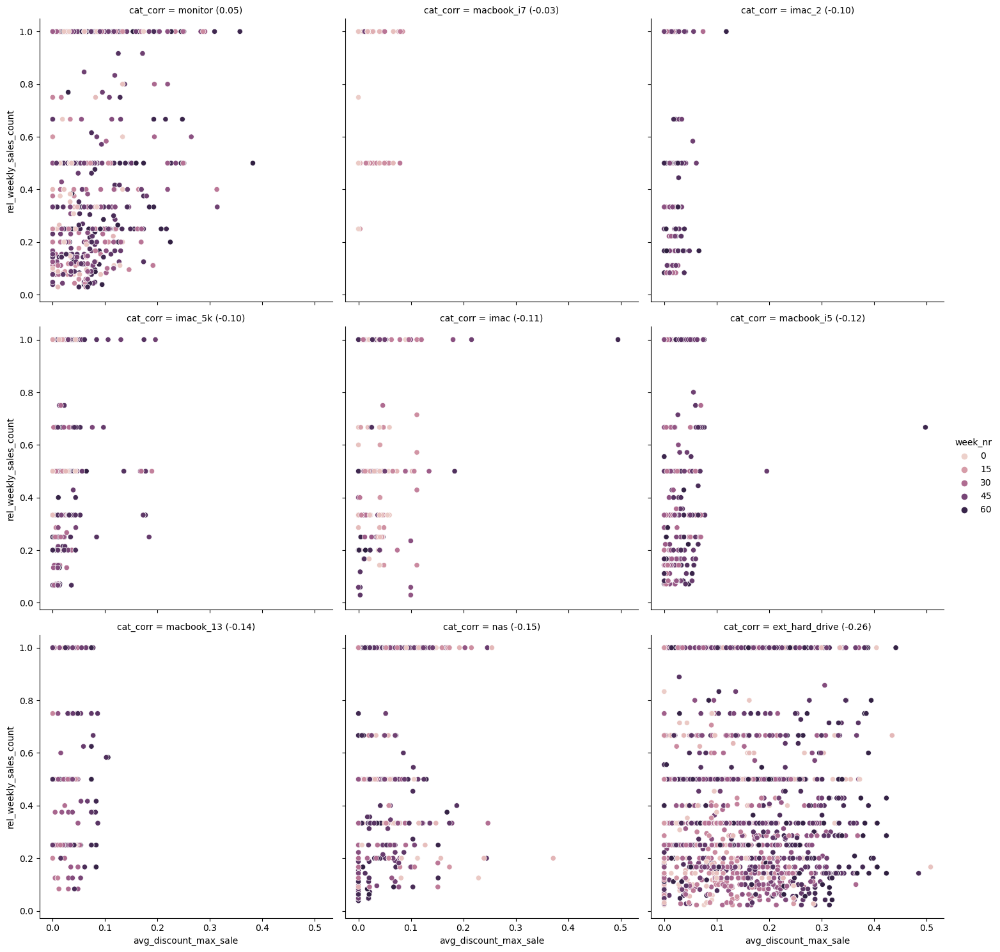

# Chapter 3: Data cleaning and story-telling

In this quite intense two-weeks chapter we returned to the example of the online Apple product and accessory retailer Eniac from our first chapter.
This time, we received a good year's worth of data from their business database consisting of

- [`products`](data/products.csv)
- [`orders`](data/orders.csv)
- [`orderlines`](data/orderlines.csv) which list the individual items in an order
- [`brands`](data/brands.csv)

The overarching business question was to draw conclusions whether the aggressive discounts actually had a relevant benefit. But before being able to work on this question, a lot of problems with the data were found and cleaning had to be done:

## Exploration and cleaning

- 12% of orderlines had two decimal dots preventing parsing as numbers: those could be fixed by just dropping the first decimal point and probably originated from erroneous conversion between European and US thousands-separator conversions
- orderlines without a matching order: dropped
- orders without any orderlines: dropped
- date-time types had to be parsed
- only 21% of all orders were actually completed: only those were considered further
- 52% were still in "shopping basket" state, 18% in "place order", 6% "pending" and 3% "cancelled"
- implausibly high outliers in unit-price in some orderlines: filtered out by limiting to completed orders
- mapping from short to long brand names were not unique

Severe problems with the `products` table:
- some product codes were in orderlines but not in the product table: those could be reconstructed using the data from orderlines
- duplicated product records
- missing data in `desc`, `price` and `type` in the products table: prices could be filled in by the maximum observed price from sales
- stale products that were never ordered in the time-frame
- `price` and `promo_price` with three decimals and sometimes two decimal points in the `products` table, too
- most `promo_price` values were completely out of range, had three decimals and two decimal dots
- same corruption was also seen in `price` but not as often
- values in the price columns that had two or less decimals only had a single dot and seemed reasonable
- boolean data read as a number

The approach for fixing the corrupted prices was assuming that the prices make sense in terms of the digits but that the decimal points are wrong. So, we removed the decimal point and determined the order of magnitude and consequently the new position for the decimal point from reference values. To do this, we used logarithm and exponentiation with base 10.

In the case of broken `price`, we were using the minimum and maximum observed unit-price from sales as the reference.

In the case of broken `promo_price`, we were using the (fixed) `price` and observed minimum unit-price from sales as the reference and used some heuristics two prevent unplausibly high or low `promo_price`.

After fixing these issues, new fixed tables were saved:

- [`products_cl`](data/products_cl.csv)
- [`orders_cl`](data/orders_cl.csv)
- [`orderlines_cl`](data/orderlines_cl.csv)

For all the details, see [this Jupyter notebook](docs/01-exploration.ipynb).

## Creating categories

Because the Eniac data contained a broad set of products, it was useful to define product categories. The `products` table had a column `type` which seemed to be a category code but unfortunately there was no mapping table giving us the meanings.

Our strategy to overcome this, was to generate per-type word-statistics from the product names which made it rather easy for us to manually reconstruct the meaning of the most relevant categories. We ended up covering more than 97% in terms of the count of products and 99.7 % in terms of sales with our new categories.

Please see [this notebook](docs/02-categories.ipynb) for how the statistics were done and [this spreadsheet](docs/type_to_name.ods) for how we defined new category names. The final type-mapping table is [this CSV file](data/type_to_name.csv).

## Analysis

Using the fixed data-sets and the reconstructed categories, we could approach the analysis:

- distribution of sales over categories
- calculation of actual discounts from the sales data
- weekly statistics of sales and discounts
- per-category and per-product correlations between sales and discount
- visualization of weekly sales vs. discount for different categories

See [this notebook](docs/03-analysis.ipynb) for the details!

## Presentation

We finally collected our findings into a five-minute [presentation](docs/Eniac’s%20strategy.pdf). Thanks to my team-mates [Felix Metz](https://www.linkedin.com/in/felix-metz-29a2842a8/) and [Lina Yordanova](https://github.com/LinaYorda) for the fun collaboration!

---
If you are interested, there are some more exercise notebooks in this repository that we did along the way!
