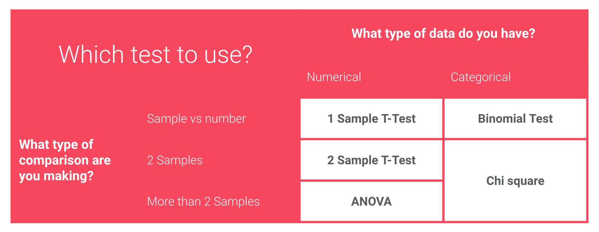

# Chapter 4: A/B Testing

A/B testing is about controlled execution of experiments and the evaluation of the statistical significance of its outcomes.

Typically such experiments are conducted to optimize web-sites or other user-interfaces for business-relevant metrics, e.g. click-through-rates in web-shops but the methods are really equally relevant for quantifying the statistical relevance of any measurement.

It consists of:

-  defining a null hypothesis: that changing a certain explanatory variable does not affect a given response variable
-  stating the alternative hypothesis: that the null hypothesis does not hold
-  defining a significance level: the probability that the null hypothesis is rejected even though it is true based on the outcome of the experiment
-  calculating the number of samples to take for the respective situation (required significance and probability distribution of the response variable
-  conducting the experiment and collecting the data
-  calculating the test-statistic
-  calculating the p-value
-  interpreting the p-value w.r.t. the defined significance level

The p-value has to be determined using different methods depending on the specific type of experiment that is conducted:

In this chapter we also revisited fundamental topics in inferential statistics:

- sampling
- bias
- estimates
- probability and distributions
- sampling distributions
- [the central-limit theorem](docs/4.1.2_central-limit-theorem_structure.ipynb)
- [confidence intervals](docs/4.1.3_confidence_intervals_structure.ipynb)

And we performed various tests on example cases:

- [one-sample t-test](docs/4.1.4_one_sample_t_test_structure.ipynb)
- [two-sample t-test](docs/4.1.5_two_sample_t_test_structure.ipynb)
- chi-square test: [Eniac scenario](docs/4.1.6_chi_square_test_structure.ipynb) and [Montana State University Library scenario](docs/montana_case.ipynb)

This chapter was just one week but filled some gaps that I feel should have already been filled in my Physics curriculum at university. Scientists should learn to check the significance of their experiments.

