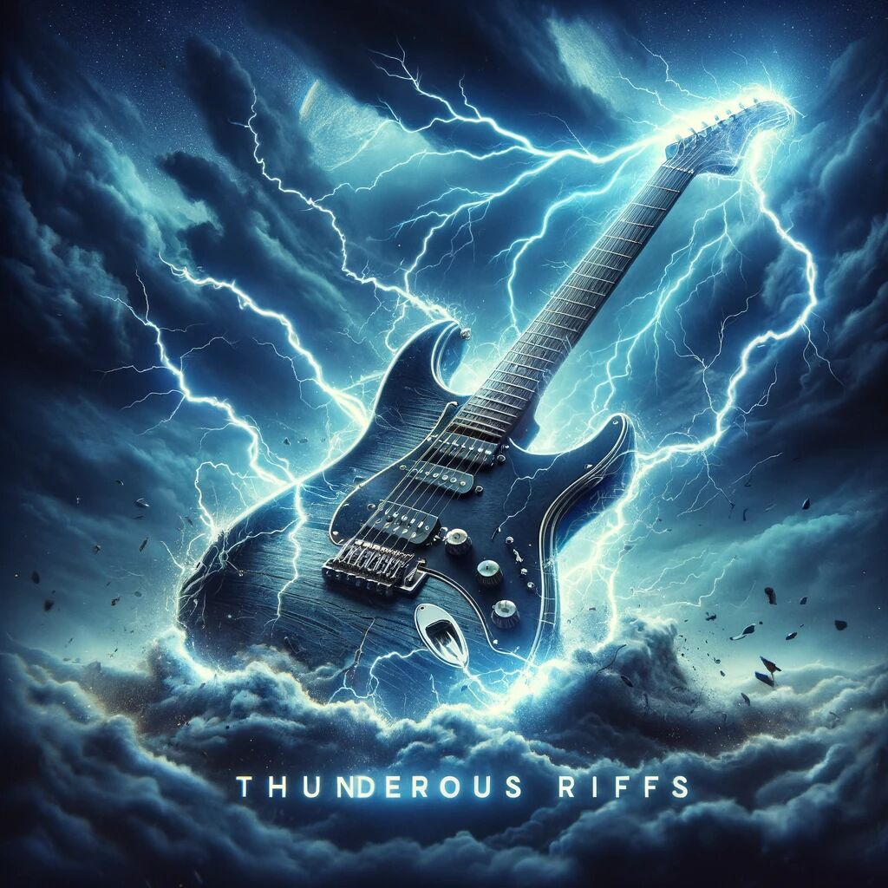
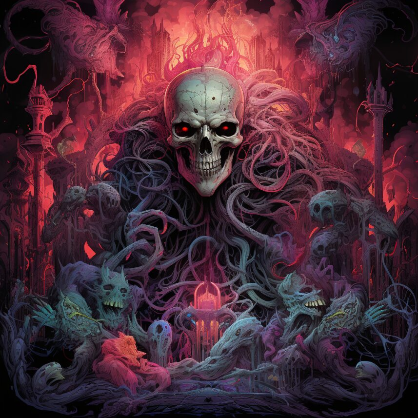

# Chapter 6: Unsupervised ML - Clustering songs

In this chapter, we did our first steps into the fascinating world of machine intelligence, i.e. identifying relevant properties of data and forming clusters of related data points.

For this, we were working on data on songs provided by Spotify, first exploratory on a small set of ten songs, then on a bigger database of 5000 songs compiled from various public Spotify playlists. The data provided by Spotify includes various [measures](https://developer.spotify.com/documentation/web-api/reference/get-audio-features):

- acousticness
- danceability
- duration in ms
- energy
- instrumentalness
- key
- liveness
- loudness
- speechiness
- tempo
- time signature
- valence

## Distance and scaling

With so many measures available, we learned how to define distances on high dimensional data and what methods are available to rescale data or reshape its statistical distribution, keeping the order of values unchanged while enabling us to control the weighting of different measures in the overall distance.

All this was explored using the Python [scikit-learn](https://scikit-learn.org) framework.
 

## Clustering with k-Means

For the actual clustering, we were using _k-Means_ with  _inertia elbow_ and _silhouette_ analysis for determining the number of clusters.

The initial exploration of the methods on the ten songs is in [exploration.ipynb](docs/exploration.ipynb). It even contains embedded Spotify widgets to listen to the songs.

## &#127929; Harmonic distance
As a special treat, I felt like making use of the _key_ and _mode_ column and calculate harmonic distance using the order of keys from the [circle of fifths](https://en.wikipedia.org/wiki/Circle_of_fifths) including the minor parallel keys which are offset by a minor third.

See [harmonic_distance.ipynb](docs/harmonic_distance.ipynb) for a nice discussion and examples. It also includes a method to transform from the standard chromatic scale to a harmonic scale and dealing with the circularity by duplicating rows at one octave above such that simple distance calculations work, too.

See [harmonic_distance.py](src/harmonic_distance.py) for a Python module with the relevant logic for reuse.

## Principal Component Analysis

For the large data-set of 5000 songs, we also looked into identifying meaningful measures in order to drop extra dimensions which helps speeding up cluster calculations.

See [exploration_5000.ipynb](docs/exploration_5000.ipynb) for all the details and pretty diagrams on the clustering in PCA space.
 

## Presentation

The deliverable of this chapter was a [presentation](https://docs.google.com/presentation/d/14kcSRi4ee7DRH0NPW0NzicEbBkhnHU_wcBEuLGoEt-Y/edit?usp=sharing) on the identified clusters which is also available as a [PDF with notes](docs/Moosic_Playlists_Presentation.pdf). Thanks to Hanne Prüfer and Sebastian Foth for the fun team-work! And thanks to [Slidesgo](https://slidesgo.com/) for the nice presentation template and [DALL-E](https://openai.com/dall-e-2) for the illustrations.
 

## Dessert

The dessert of this was to use the [Spotify API](https://developer.spotify.com/) with [spotipy](https://spotipy.readthedocs.io/) to upload the playlists to Spotify.

And here, as the cherry on-top, I wrote a simple [random-walk](https://en.wikipedia.org/wiki/Random_walk) through the top-50 of each cluster following harmonically pleasant transitions. See the [harmonic_playlists.ipynb](docs/harmonic_playlists.ipynb) notebook. So, even though harmonic distances did not help with clustering, it is of good use for ordering songs within a playlist.

To appreciate that the harmonies in fact often blend quite nicely, set the Spotify App's crossfade feature to 12 seconds and pay attention to the transitions. These are the generated playlists:

[<figure align="center"><figcaption>Feelgood Frequencies</figcaption></figure>](https://open.spotify.com/playlist/6uM33lzLVKtQUr7HVXE4El?si=85730df302864825)
[<figure align="center"><figcaption>Groovy Pop Blend</figcaption></figure>](https://open.spotify.com/playlist/7blNRyyIQnRqj8Cwksis5C?si=02611e4e08ac4d13)

[<figure align="center"><figcaption>Study Focus</figcaption></figure>](https://open.spotify.com/playlist/2S9hpuyFWv0tbAiCoX9qmC?si=c1f24efc3b9740ea)
[<figure align="center"><figcaption>Bars & Beats</figcaption></figure>](https://open.spotify.com/playlist/2UfeQYHIX57ycihZgX73Fg?si=7b83ebe6ed5a463e)

[<figure align="center"><figcaption>Thunderous Riffs</figcaption></figure>](https://open.spotify.com/playlist/6HQlDhCiT48pZND5b8X3Py?si=ad5c04891c754a64)
[<figure align="center"><figcaption>Death Metal Essentials</figcaption></figure>](https://open.spotify.com/playlist/7CcAmzpv4KMjmrY3Ax43vq?si=25b8f0e3d0b24132)

In particular the last playlist definitely has its problems such as outliers that donot fit at all and of course, the music and lyrics of the last two playlists are NSFW.
