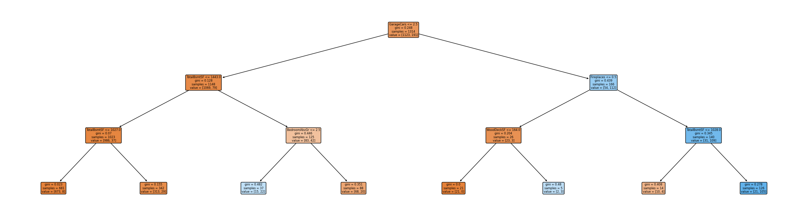
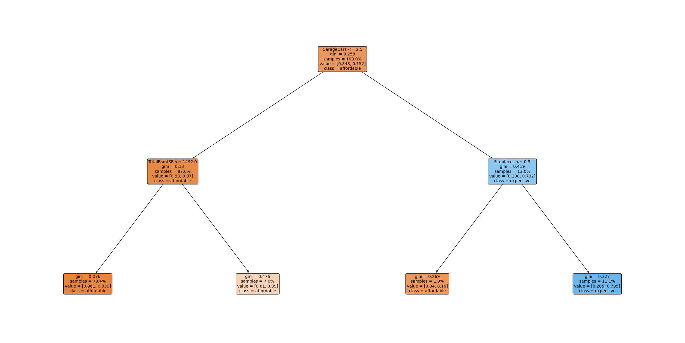
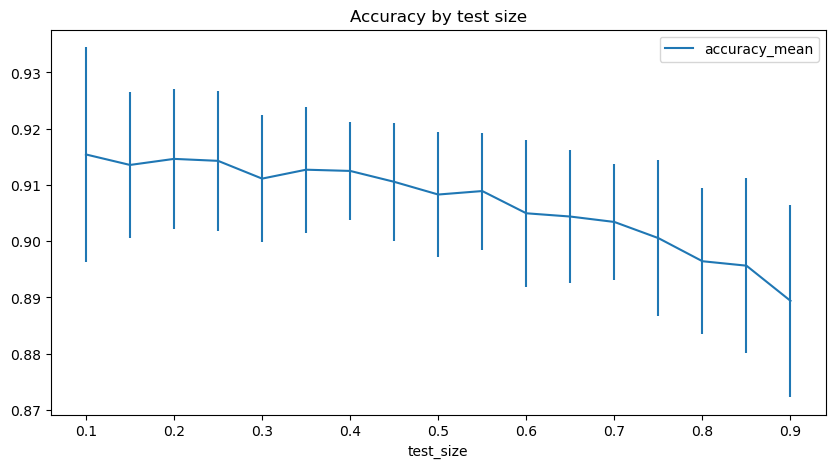
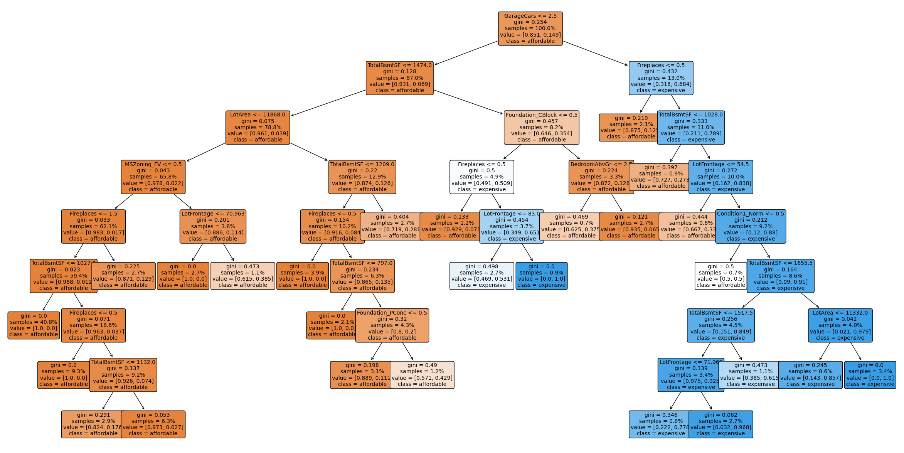
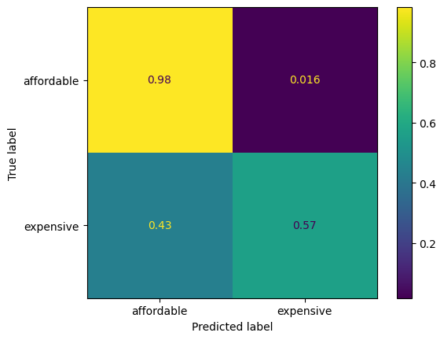
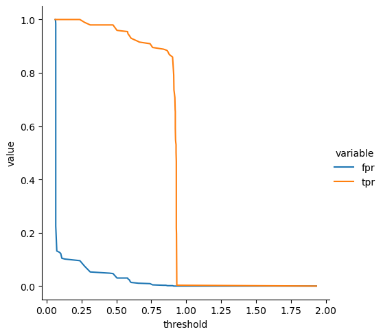
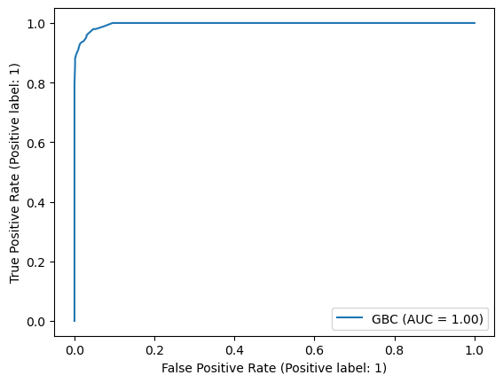
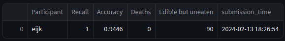

# Chapter 6: Supervised ML - Classification and Regression

In this two-weeks chapter, we learned the basics of supervised machine-learning. Machine-learning uses an __abundance__ of different models to predict outcomes from given data. The predicted outcome is categorical for __classification__ problems or numerical values for __regression__ problems. The given data can contain any combination of numerical, ordinal and nominal features.

For our exercise, we had three different scenarios:

- classification: predicting whether houses were _expensive_ or not given 79 features (35 numerical, 20 ordinal and 24 nominal) from a house sales database
- regression: predicting _house prices_ from the same database but given prices instead of a binary class of being expensive or not
- classification: predicting whether a type of mushroom is _poisonous_ or not given 6 nominal features; here, it was important to tune the decision threshold in a way that the number of false-negatives was minimized such that no poisonous mushrooms were identified as edible (at the expense that more edible mushrooms were needlessly identified as poisonous)

For each scenario, we explored different classifiers and regressors and systematically tried combinations of the corresponding model parameters using __parameter-grid search__ with cross-validation.

The key focus here is the balancing of variance vs. bias of the model. __Bias__ means how rigid a given model is with respect to the variance of the training data. For example, a simple linear regression is quite rigid, i.e. has __high bias__ towards its model assumptions, and will not adapt to wiggles in the training data. At the same time, it will give a reliable measurement of the overall linear relationship in the training data.

Other models like decision-trees can fully adapt to the variance in the training data (if it is not contradictory in itself), hence have very __low bias__, but will usually not represent general relations.

__Cross-validation__ is used when increasing the bias of the models by limiting how well they can adapt to the specifics of the training data set such that they generalize well. For that, they are trained on subsets of the data and tested against the remaining part multiple times with different splits.

Because this is a content-rich chapter, here is the outline:

- [House price classification](#house-price-classification)
  - [Step 0: A manual baseline classifier](#step-0-a-manual-baseline-classifier)
  - [Step 1: A decision-tree classifier](#step-1-a-decision-tree-classifier)
  - [Step 2: Parameter grid-search with cross-validation](#step-2-parameter-grid-search-with-cross-validation)
  - [Step 3: Handling categorical data](#step-3-handling-categorical-data)
  - [Next steps: More models, confusion matrix, ordinal encoding](#next-steps-more-models-confusion-matrix-ordinal-encoding)
  - [Competition time](#competition-time)
- [House price regression](#house-price-regression)
  - [Per-sq.ft. prices](#per-sqft-prices)
  - [Competition](#competition)
- [More classification: Mushrooms :skull\_and\_crossbones:](#more-classification-mushrooms-skull_and_crossbones)
  - [Automatic threshold calculation](#automatic-threshold-calculation)
  - [Competition](#competition-1)
  - [:gift: Wrap it up - into a streamlit app!](#gift-wrap-it-up---into-a-streamlit-app)
- [Conclusions](#conclusions)

## House price classification

We were exploring classification in multiple steps:

### Step 0: A manual baseline classifier

See this [notebook](docs/iteration_0.ipynb).

After looking at the distribution of the features for the _expensive_ and _not expensive_ class, I came up with three well distinguishing features, _lot area_, _total basement area_ and _capacity of the garage_. Then I used optimization of the thresholds to come up with a simple baseline classifier.

This already gave a baseline accuracy of about 90%.

### Step 1: A decision-tree classifier

See this [notebook](docs/iteration_1.ipynb).

Picking relevant features and thresholds can be done systematically in an automatic fashion. For this, we got familiar with the [scikit-learn](https://scikit-learn.org) Python library. It offers an impressive set of classifiers, regressors and transformers which makes it easy to combine all the different steps for processing data and training models into sophisticated data pipelines. One of the beautiful points is that all the different models share a common interface such that switching between different models and details of preprocessing is _easy_.

As our data had missing data in some columns, we also used an _imputer_ which filled in missing data with median values across the training data-set.

The first step into balancing _bias_ and _variance_ for the decision-tree was to limit the number of levels, i.e. the maximum number of features, the tree was allowed to take into account for every individual decision. I varied the maximum allowed depth until the tree did not grow anymore and recorded the accuracy. As expected the success on the test data-set had a maximum accuracy in the middle range between underfitted and overfitted and it turned out, 3 levels were optimal for a well generalizing decision tree.

That was surprisingly close to the manual baseline classifier, so the accuracy on the test data-set was only slightly better at 93.2%.

### Step 2: Parameter grid-search with cross-validation

See this [notebook](docs/iteration_2.ipynb).

scikit-learn includes a systematic way to find optimal parameters for the balance between _bias_ and _variance_ with `GridSearchCV` which splits the training-set into a configurable number of sub-training/test-sets and uses them to evaluate which combination of parameters give the best performance.

With this, I also played with a parameter that prevents new decision nodes to be created when there is no sufficient improvement. With this, you can create smaller trees with similar performance. This optimization led me actually to a 2-level tree with a similar accuracy as before. Obviously, the previous manual optimization was not bad, so I could not easily surpass it, even with more parameters under testing.

I was interested in how much the performance depends on the actual split between training- and test-dataset and their ratio. Stratifying the split w.r.t. the labels reduces the variance of results. The result can be visualized in this plot:

### Step 3: Handling categorical data

See this [notebook](docs/iteration_3.ipynb).

Up to step 2, all data had been numeric. Now, we received an extended data-set which included categorical data like the type of heating or the proximity to certain types of roads. For such data, we learned to use _one-hot_ encoding which creates a separate column for each category of each categorical column and sets the values to 1 if present, 0 otherwise. Such data quickly gets a big number of feature dimensions depending on the number of categories. Fortunately, scikit-learn again makes it quite easy to handle that.

Also, depending on the split, optimal parameters varied quite a lot, so sometimes, even 8-level trees were considered optimal such as this one:

As you can see, big parts of the tree have the same outcome, so the distinctions do not really contribute to the predictive power.

__Surprisingly__, the additional nominal features did not contribute to the predictions and even made the predictions slightly worse which is puzzling as the decision trees could just ignore them. So, sometimes dropping features may make your predictions better.

### Next steps: More models, confusion matrix, ordinal encoding

Now that we were in full speed, a lot of more was covered:

- more models:
  - k-nearest-neighbors
  - logistic regression
  - support-vector-classification
  - random forests
- scaling / normalization: some models, in contrast to decision-trees, are sensitive to the relative values of features, so normalization is crucial
- confusion matrix: better evaluation of performance showing true-negative, true-positive, false-negative and false-positive predictions\
  
- ordinal encoding: how to transform categorical data that has an order (e.g. levels of building quality) into numbers

### Competition time

See this [notebook](docs/iteration_6_competition.ipynb)

In the end of that section, we tried to optimize our models and try them on a test-data set for which we did not know the results and submitted the predictions to a web-app which would then grade our results.

I had quite good success with a random-forest-model and with parameter-tuned logistic regression and ranked third place.

## House price regression

The second part of this chapter on supervised machine-learning was using a similar data-set, only this time instead of predicting a category (expensive vs. non-expensive), we received the actual selling price and tried to predict that.

For regression, there is another zoo of models in scikit-learn that we could try out. Many models from classification have siblings in the regression business and thankfully, most of the data-processing is exactly the same.

### Per-sq.ft. prices

For the regression, I had the idea that in general prices are proportional to the living area of the house and the quality and other features would influence the per-sq.ft. price. So I learned to write a scikit-learn wrapper with which I could turn any existing regressor into one that would estimate the per-sq.ft. instead of the total price. My idea was that this e.g. for make it easier for a decision-tree model to come up with a successful prediction if it wouldn't also need to represent the dependence on the living area.

This actually turned out to be successful: Models that were rescaled in this way, in general performed a bit better.

### Competition
See this [notebook](docs/iteration_7_regression.ipynb).

Finally, we again compared our optimized models on unknown data. My best model, again in the top-three, was a per-sq.ft. rescaled gradient boosted random forest of 300 basic estimators of a maximum depth of 5.

## More classification: Mushrooms :skull_and_crossbones:

As a final challenge, we were using a completely new data-set which only had nominal features about the mushrooms like cap shape and colors of different parts of the mushroom and the designation whether the mushroom is poisonous or not.

However, in this case, false-negatives (predicting the mushroom as edible when it is poisonous) are a lot worse than false-positives (predicting the mushroom to be poisonous when it in fact is edible). So, here, the challenge is to tune the threshold of the classifier such that false-negatives are minimized.

For this, the receiver-operating-characteristic must be analyzed which shows the dependence of predictive quality for poisonous and non-poisonous mushrooms depending on the threshold. Drawn w.r.t. to the threshold, the plot looks like this:

And the ROC curve looks like this:

Both show that there exist threshold values where the true-positive-rate is still at 1 (meaning the false-negative-rate is still at 0) and the false-positive-rate is already relatively low.

### Automatic threshold calculation

The curves can of course be evaluated automatically and I spinned that into a wrapping classifier that takes any scikit-learn classifier that allows to estimate the probability of each class (poisonous vs. edible) and will determine a threshold that satisfies a given maximum false-negative rate.

See the [FalseNegativeLimitedClassifier](src/fnlc.py) and this [notebook](docs/mushrooms.ipynb) for details.

### Competition

Again, we challenged each other in a competition. It looked good! No people killed by my classifier! And only few edible mushrooms wasted, too.

### :gift: Wrap it up - into a streamlit app!

The icing on the cake was to save the tuned model as a Python pickle file such that I could use it in a streamlit web-app.

Take a look at the [source](src/streamlit-mushrooms/streamlit-mushrooms.py) or give the [app](https://champignon.streamlit.app) a spin!

> ☠️🍄 This is a toy example. Do not use this classifier for real-world applications. __Donot eat mushrooms based on the predictions of this classifier!__

## Conclusions

Wow, that were definitely the two most content-packed weeks of the bootcamp! I liked it but need to take a deep breath now!

