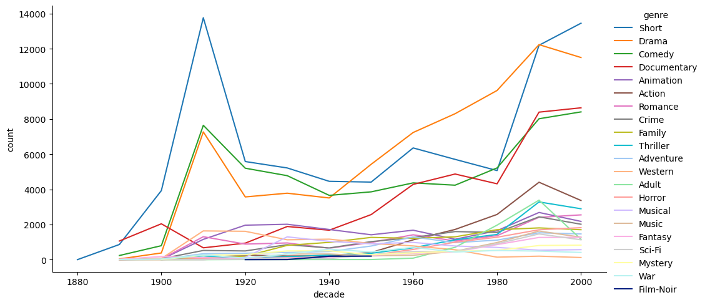

# Chapter 9: Advanced SQL 🎓

In this chapter, we took another week to go deeper into some specific SQL topics:

- sub-queries
- temporary tables
- stored routines
- window functions

## Challenges solved with a simple SQL file 📜

For the _sub-queries_ and _temporary tables_, we were again working on the [Magist](data/magist_dump) database from earlier chapters and were given a bit more challenging tasks:

> - Select all the products from the health_beauty or perfumery categories that have been paid by credit card with a payment amount of more than 1000$, from orders that were purchased during 2018 and have a ‘delivered’ status.
> - For the products that you selected, get the following information:
>   - The average weight of those products
>   - The cities where there are sellers that sell those products
>   - The cities where there are customers who bought products

Because I know _common table expressions (CTE)_ from earlier projects and quite like them because they allow to give _reasonable names_ to intermediate results and to _step-by-step_ build on top of each other, I came up with this [solution](docs/01-challenge-magist.sql). It also uses the `UNION` keyword to collect the results for the different tasks into a single result table.

## Jupyter notebooks with the SQL extension 💕

Then, I learned about the fantastic [SQL](https://github.com/catherinedevlin/ipython-sql) extension for IPython that allows you to use Jupyter notebooks as an interactive SQL shell and used that for more challenges on _sub-queries_, _temporary tables_ (or _CTEs_) and _window functions_ using [Internet Movie Database](https://www.imdb.com/) data: See this [notebook](docs/02-challenge-imdb.ipynb).

Of course, this also allows to use other Python functionality like Seaborn plots and makes Jupyter notebooks an awesome tool to explore SQL databases and prototype SQL code!

## Stored routines: Automatic restocking order generation for Northwind Traders 🛒

For our exercises on _stored SQL functions_ and _procedures_, we were given the [Northwind](data/northwind-sql.sql.xz) sales database which includes products, orders and restocking levels. As we were free to find our tasks ourselves, I decided to develop logic to generate automatic restocking orders:

> The idea is to evaluate the current stock, including already placed but not yet shipped orders and to decide for which suppliers orders should be issued.
> - orders are only placed for suppliers for which at least one product is running out-of-stock
> - for suppliers for which at least one product needs to be restocked, all products that are going below reorder-level are stocked up to the reorder-level
> - products that are marked as discontinued must be skipped

For the architecture, I decided to produce the result of the restocking logic as JSON output on the database-side which would then be passed on to a document generator which in this example was written in Python and would generate Markdown/HTML documents which could then be emailed/faxed/mailed to the respective suppliers.

Take a look at this [notebook](docs/03-stored-procedures-and-functions-northwind.ipynb)!

## More challenges on window functions 🪟

Finally, we focused a little more on window functions using the publications database from our SQL primer course. Take a [look](docs/04-window-functions-publications.ipynb) if you are interested!

---
I have been working with many SQL databases in the past, including MySQL, MariaDB, SQLite and PostgreSQL but as always, there is still more to learn and I really enjoyed learning about Jupyter notebooks with the SQL extension. That is definitely technology, I will use in the future!

