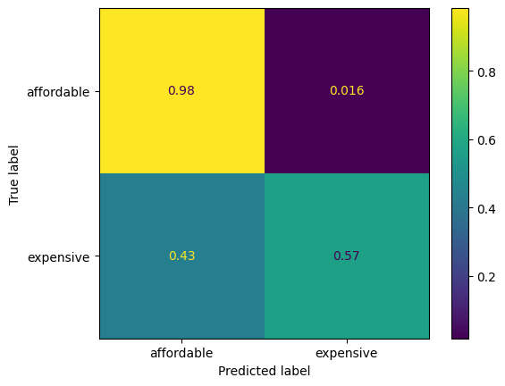

# WBS Data Science Bootcamp Portfolio

## Primer: A conversation with ChatGPT 3.5 about SQL challenges

It's interesting to see how well ChatGPT works and where its (current) limitations are, so I chatted with it about some of our SQL challenges. I found it a [fun read](00_primer_chatgpt_on_sql/ChatGPT_SQLChallenges5.md)!

## Primer: No-Hangman

At the end of the two-weeks primer course on SQL, Tableau and Python, everybody builds a simple text-based Hangman (click on the image for my take on it):

## Chapter 1: Eniac expansion from Spain to Brazil

In this [case study](01_eniac_magist_case_study), the company Eniac wants to expand
its business to Brazil and evaluates the potential after-sales fulfillment partner
Magist for its suitability.

## Chapter 2: Introduction to pandas

As second basic data-handling system after SQL, we were introduced to the Python
[pandas](https://pandas.pydata.org/) library.
Read about our challenges [here](02_pandas)!

## Chapter 3: Data Cleaning and Storytelling

In this quite intense two-weeks chapter, we were diving deep into a sales database with severe problems and learned how to still extract useful conclusions from it. Take a [look](03_eniac_data_cleaning)!

## Chapter 4: A/B Testing
*coming soon*

## Chapter 5: Data Pipelines on the Cloud

In [this](05_cloud_pipelines) two-week project, we learned and exercised ETL data-engineering skills, i.e. extracting, transforming and loading data into storage for comprehensive analysis. We scraped the web, used public APIs, transformed and augmented the data and stored it in an SQL database. The finished ETL process was then wrapped into a Google cloud function for automatic execution and I even went further to produce automatically updated reports on the data.

One of the deliverables was a blog post which I wrote on [dev.to](https://dev.to/tvogel/from-scraping-in-the-cloud-to-streams-of-insights-oe9).

## Chapter 6: Unsupervised ML - Clustering Songs

In [this](06_unsupervised_ml_clustering_songs) one-week project we learned about high dimensional distances, scaling, PCA, k-Means, inertia elbow and silhouette score and the Spotify API.

My special treat was to apply harmony theory to order songs by harmonic distance.
 

## Chapter 7: Supervised ML - Housing Prices and Mushroom classification

Two weeks were devoted and crammed with insights into
[supervised machine-learning](07_supervised_ml_house_prices). We learned about

- training data preparation
- classification, regression
- prediction metrics
- decision trees, gradient boosted random forests
- linear and logistic regression
- support vector classifiers
- one-hot and ordinal encoding
- parameter optimization and cross-validation

and even _pickling data_ and creating classifiers as web-apps with [streamlit](https://streamlit.io/)! Our model data-sets were selling prices of houses :european_castle: and poisonous vs. edible mushrooms :mushroom:.

## Chapter 8: Recommender systems

This week took us to learn about different ways to extract movie recommendations for the fictitious WBSFLIX online DVD rental shop from previous movie ratings. Read all about it [here](08_recommender_system) and check out the recommendation app!

## Chapter 9: Advanced SQL

_Coming soon_
